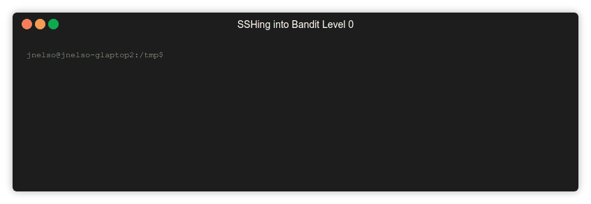
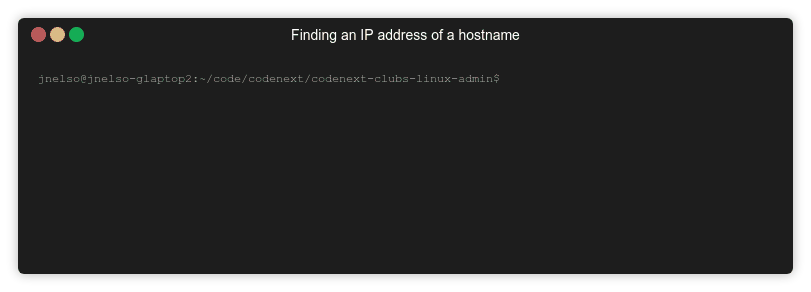

# Level 0 Solution

This level is mainly about connecting to the remote server. The server is
just a computer that is somone on the network (or internet if you will). We
use the `ssh` a commmand that lets use login to the remote server. There's a few
important concepts to understand, let's break down the command a bit more:

## What is the `ssh` command?

### Command Demo: SSH into level0


### Command Breakdown

The command looks like this:

```
# A basic ssh command
ssh $USERNAME@$SERVER_NAME -p $PORT

# Example from level0:

|---The Command 
|   |--- The User name
|   |       |--- The hostname of the remote server
|   |       |                              |---The service port
v   v       v                              v
ssh bandit0@bandit.labs.overthewire.org -p 2220
````
Where:

* _$USERNAME_: Is the username to login with (here `bandit0`)
* _$SERVER_NAME_: Is the server's name or IP address (here `bandit.labs.overthewire.org`)

* _$PORT_: Is the service port to connect on (here `2220`). More on this in a bit.

## What is a `server` what is a `port`?

A *server* is just a computer that lives somewhere-- Your laptop can be a
server. All servers run software called *services*, these services do
things like provide a web page (i.e. a *web server*) or provide access
to files (i.g. a *file server*).

### Command Demo: Finding a Server's IP address

In order to talk a `server` you need to know it's `hostname` or `IP address`.
A server can have more than one hostname or IP address as we'll see in a sec.

You can find out a servers IP address with the `nslookup` command. For
example:



### Command Breakdown 

```
nslookup bandit.labs.overthewire.org

Server:         127.0.0.1
Address:        127.0.0.1#53

Non-authoritative answer:
bandit.labs.overthewire.org     canonical name = leelo.overthewire.org.
leelo.overthewire.org   canonical name = otw.cracksucht.de.
Name:   otw.cracksucht.de <--- Another name for the same server.
Address: 176.9.9.172 
         ^
         |---- The IP Address of the host bandit.labs.overthewire.org
```
**Learn More**:
* Secure Shell (SSH): https://searchsecurity.techtarget.com/definition/Secure-Shell
* Ports: https://en.wikipedia.org/wiki/Port_(computer_networking)

 

**Discussion topics**

1. What is the `ssh` command used for?
2. What is the `-p` flag used for?
3. What is `localhost`?
4. Once you are logged into a level, why don't you have to give the `-p` flag to log into another level?