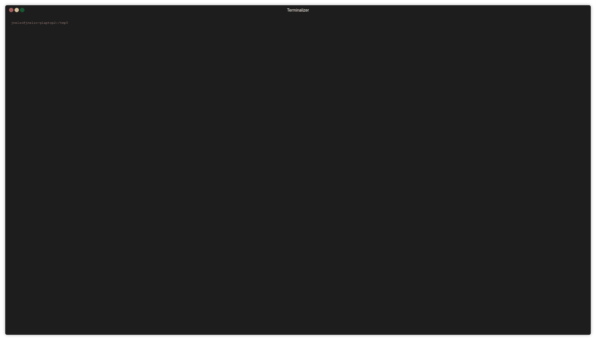

## <a name='Overview'></a>Overview

The first part of this level is just about connecting th the remote computer. The second part is about finding and reading files on a linux computer.

## <a name='TableofContents'></a>Table of Contents
<!-- vscode-markdown-toc -->
* [Overview](#Overview)
* [Table of Contents](#TableofContents)
* [Part 1: Connecting to the remote commputer](#Part1:Connectingtotheremotecommputer)
	* [What is the `ssh` command?](#Whatisthesshcommand)
		* [Command Demo: SSH into level0](#CommandDemo:SSHintolevel0)
		* [Command Breakdown](#CommandBreakdown)
	* [What is a `server`? What is a `port`?](#WhatisaserverWhatisaport)
		* [Command Demo: Finding a Server's IP address](#CommandDemo:FindingaServersIPaddress)
		* [Command Breakdown](#CommandBreakdown-1)
	* [Discussion topics](#Discussiontopics)
* [Part 2: Completing the Level Goal](#Part2:CompletingtheLevelGoal)
	* [Command Demo: How to find what commands dow with `man`](#CommandDemo:Howtofindwhatcommandsdowwithman)
	* [Command Demo: Listing the files in a directory with `ls`](#CommandDemo:Listingthefilesinadirectorywithls)
	* [Command Demo: Reading a file with `cat`](#CommandDemo:Readingafilewithcat)
	* [Command Demo: What directory am In again? Find out with `pwd`](#CommandDemo:WhatdirectoryamInagainFindoutwithpwd)

<!-- vscode-markdown-toc-config
	numbering=false
	autoSave=true
	/vscode-markdown-toc-config -->
<!-- /vscode-markdown-toc -->


## <a name='Part1:Connectingtotheremotecommputer'></a>Part 1: Connecting to the remote commputer

This section covers connecting to the remote server (computer). A server is
just a computer that is somone on the network (or internet if you will). We
use the `ssh` a commmand that lets use login to the remote server. There's a
few important concepts to understand, let's break down the command a bit
more:

### <a name='Whatisthesshcommand'></a>What is the `ssh` command?

#### <a name='CommandDemo:SSHintolevel0'></a>Command Demo: SSH into level0


#### <a name='CommandBreakdown'></a>Command Breakdown

The command looks like this:

```
# A basic ssh command
ssh $USERNAME@$SERVER_NAME -p $PORT

# Example from level0:

|---The Command 
|   |--- The User name
|   |       |--- The hostname of the remote server
|   |       |                              |---The service port
v   v       v                              v
ssh bandit0@bandit.labs.overthewire.org -p 2220
```

Where:

* _$USERNAME_: Is the username to login with (here `bandit0`)
* _$SERVER_NAME_: Is the server's name or IP address (here `bandit.labs.overthewire.org`)

* _$PORT_: Is the service port to connect on (here `2220`). More on this in a bit.

### <a name='WhatisaserverWhatisaport'></a>What is a `server`? What is a `port`?

A *server* is just a computer that lives somewhere-- Your laptop can be a
server. All servers run software called *services*, these services do
things like provide a web page (i.e. a *web server*) or provide access
to files (i.g. a *file server*).

#### <a name='CommandDemo:FindingaServersIPaddress'></a>Command Demo: Finding a Server's IP address

In order to talk a `server` you need to know it's `hostname` or `IP address`.
A server can have more than one hostname or IP address as we'll see in a sec.

You can find out a servers IP address with the `nslookup` command. For
example:


#### <a name='CommandBreakdown-1'></a>Command Breakdown 

```sh

nslookup bandit.labs.overthewire.org

Server:         127.0.0.1
Address:        127.0.0.1#53

Non-authoritative answer:
bandit.labs.overthewire.org     canonical name = leelo.overthewire.org.
leelo.overthewire.org   canonical name = otw.cracksucht.de.
Name:   otw.cracksucht.de <--- Another name for the same server.
Address: 176.9.9.172
         ^
         |---- The IP Address of the host bandit.labs.overthewire.org
```

**Learn More**:

* Secure Shell (SSH): https://searchsecurity.techtarget.com/definition/Secure-Shell
* Ports: https://en.wikipedia.org/wiki/Port_(computer_networking)

### <a name='Discussiontopics'></a>Discussion topics

1. What is the `ssh` command used for?
2. What is the `-p` flag used for?
3. What is `localhost`?
4. Once you are logged into a level, why don't you have to give the `-p` flag to log into another level?

## <a name='Part2:CompletingtheLevelGoal'></a>Part 2: Completing the Level Goal

This level is pretty simple so I'll only provide command demos. There are suggested commands you can use and I encourage you to read the `man` page for each of them to get an overview of what they do.

### <a name='CommandDemo:Howtofindwhatcommandsdowwithman'></a>Command Demo: How to find what commands dow with `man`



### <a name='CommandDemo:Listingthefilesinadirectorywithls'></a>Command Demo: Listing the files in a directory with `ls`


### <a name='CommandDemo:Readingafilewithcat'></a>Command Demo: Reading a file with `cat`


### <a name='CommandDemo:WhatdirectoryamInagainFindoutwithpwd'></a>Command Demo: What directory am In again? Find out with `pwd`

