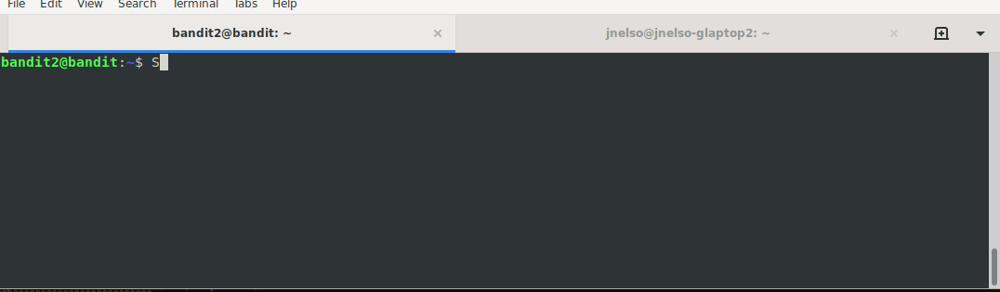

# Level 2 

## Overview

This level is pretty trivial. The main point here is that commands get
tripped up when the filenames are wierd. 

## Table of Contents
<!-- vscode-markdown-toc -->
* [Overview](#Overview)
* [Table of Contents](#TableofContents)
* [Completing the Level Goal](#CompletingtheLevelGoal)
	* [Command Demo](#CommandDemo)
	* [Command Breakdown](#CommandBreakdown)
* [Discussion Points](#DiscussionPoints)
* [Learn More](#LearnMore)

<!-- vscode-markdown-toc-config
	numbering=false
	autoSave=true
	/vscode-markdown-toc-config -->
<!-- /vscode-markdown-toc -->

## Completing the Level Goal

You can always use the `tab` key on your keyboard to auto-complete a
filename. Otherwise, you have to escape special chracters like `space` using
the `\` character.

### Command Demo

### Command Breakdown

In general, you should follow these best practices when naming files on a *nix commands. These aren't hard rules but they can help you avoid snags when working with file later (such as scripting or reading files in a program).

* Name all your files lower case.
* Instead of using a space, use an `_` or a `–`
* Don't use [special characters](https://mywiki.wooledge.org/BashGuide/SpecialCharacters) in file names. Only alphanumeric characters, periods, underscores and hyphens and don’t use symbols like `%`, `$`, and so forth.
* Keep the file names short and descriptive.

## Discussion Points

Ask questions in order to probe for understanding.

## Learn More

* [Best practice for naming files in Linux](https://www.inmotionhosting.com/support/website/file-management/best-practice-for-naming-files-in-linux)
