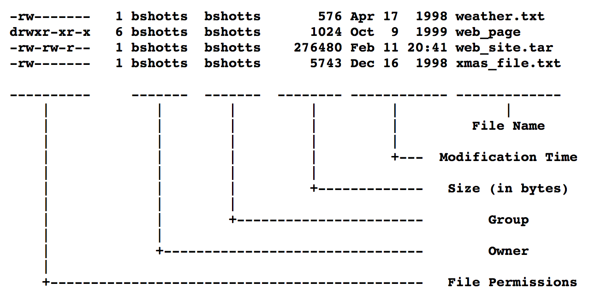
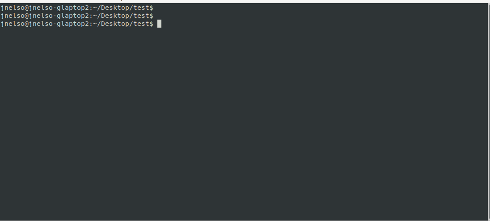
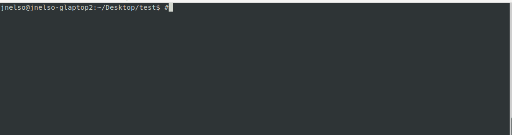

# Level 3

## <a name='Overview'></a>Overview

This level is about how to move between directories on a *nix computer and finding hidden files.

## <a name='TableofContents'></a>Table of Contents
<!-- vscode-markdown-toc -->
* [Overview](#Overview)
* [Table of Contents](#TableofContents)
* [Completing the Level Goal](#CompletingtheLevelGoal)
	* [Command Demo](#CommandDemo)
	* [Command Breakdown](#CommandBreakdown)
	* [Breakdown of the `ls -l` output](#Breakdownofthels-loutput)
	* [Navigating directories with `cd` on the terminal](#Navigatingdirectorieswithcdontheterminal)
		* [Current Directory](#CurrentDirectory)
		* [Parent Directory](#ParentDirectory)
* [Discussion Points](#DiscussionPoints)
* [Learn More](#LearnMore)

<!-- vscode-markdown-toc-config
	numbering=false
	autoSave=true
	/vscode-markdown-toc-config -->
<!-- /vscode-markdown-toc -->

## <a name='CompletingtheLevelGoal'></a>Completing the Level Goal

Navigating files is simple on the shell: use the `cd` command. But not every
file is show by default. Some files are hidden. Typically these files store
configuration (like `.gitignore`). In *nix, everything is a file so even
folders can be hidden (like `~/.ssh`).

Hidden files aren't completely hidden--someone looking for them can easily
find them. Hidden files aren just not shown by default.

### <a name='CommandDemo'></a>Command Demo


### <a name='CommandBreakdown'></a>Command Breakdown

There are a few different ways to find hidden files. One example is with the `ls` command:

```shell
bandit3@bandit:~/inhere$ ls -la
total 12
drwxr-xr-x 2 root    root    4096 Oct 16  2018 .
drwxr-xr-x 3 root    root    4096 Oct 16  2018 ..
-rw-r----- 1 bandit4 bandit3   33 Oct 16  2018 .hidden
bandit3@bandit:~/inhere$ 
```
Looking at the `man ls` entry, we can see the `-a` flag list *all* all files
including hidden files.

TIP: Try using the `find` command to get a listing of all the files in the
directory.

### <a name='Breakdownofthels-loutput'></a>Breakdown of the `ls -l` output

In the previous section, you saw the long output of the `ls` command. Check
out this section for info on what each column means.



### <a name='Navigatingdirectorieswithcdontheterminal'></a>Navigating directories with `cd` on the terminal

In a previous section, the `ls -l` output listed two additional folders. They
were the `.` and `..` folders. There are other special folders you can use to quickly jump around a *nix file system.

* `.` : Refers to the current directory.
* `..` : Refers to the parent directory (or one level up).
* `/` : This refers to the *root* directory. It's the highest level directory.

There are other shortcuts that point at well known directories:

* `~/`: A shortcut to the current user's home directory .
* `$HOME`: This is a *shell* variable that refers to the current user's home
 directory by default.

You can use these shortcuts to quickly move around the filesystem as you'll see in the next few demos:

#### <a name='CurrentDirectory'></a>Current Directory



#### <a name='ParentDirectory'></a>Parent Directory



## <a name='DiscussionPoints'></a>Discussion Points

* How do you hide a *file* in *nix? A *folder*?
* Try jumping to your working directory using the short cuts from the previous section.
* Why is the `/` directory called the *root* directory.

## <a name='LearnMore'></a>Learn More

* [An Easy Way to Hide Files and Directories in Linux](https://www.tecmint.com/hide-files-and-directories-in-linux/)
* [ls -l explained](https://www.garron.me/en/go2linux/ls-file-permissions.html)
* [Root Directory Definition](http://www.linfo.org/root_directory.html)