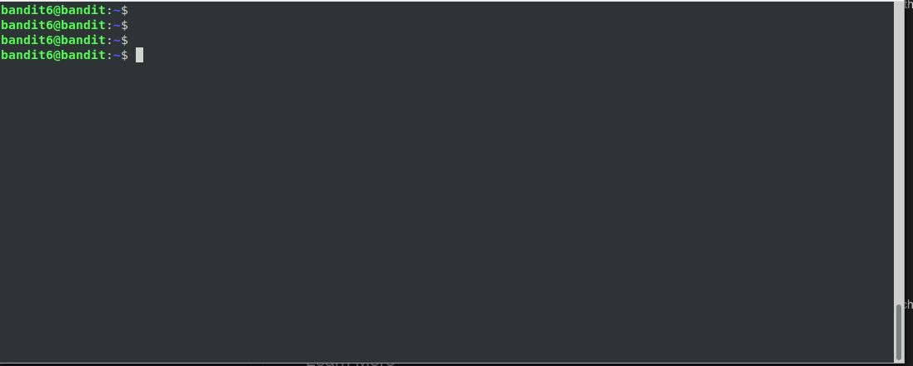

# Level 6

## <a name='Overview'></a>Overview

This level is pretty much the same as the last level, except the file isn't
in your home directory it can be in any directory.

<!--NOTE: Do not edit table of content's. This is auto generated using an vscode-extension. -->
## <a name='TableofContents'></a>Table of Contents
<!-- vscode-markdown-toc -->
* [Overview](#Overview)
* [Table of Contents](#TableofContents)
* [Completing the Level Goal](#CompletingtheLevelGoal)
	* [ Command Demo](#CommandDemo)
	* [ Command Breakdown](#CommandBreakdown)
* [Learning Byte: What is `/dev/null`?](#LearningByte:Whatisdevnull)
* [Discussion Points](#DiscussionPoints)
* [Learn More](#LearnMore)

<!-- vscode-markdown-toc-config
	numbering=false
	autoSave=true
	/vscode-markdown-toc-config -->
<!-- /vscode-markdown-toc -->

## <a name='CompletingtheLevelGoal'></a>Completing the Level Goal

In this challenge the file can be *anywhere* on the server, in any directory! That means we have to start our search at the *root* directory (the root directory was introduced in a previous [write up](https://github.com/j0n3lson/codenext-clubs-linux-admin/tree/master/solutions/03#navigating-directories-with-cd-on-the-terminal)).

Of course we use the handy `find` command with the right flags to find the specific file

### <a name='CommandDemo'></a> Command Demo



### <a name='CommandBreakdown'></a> Command Breakdown

Let's break down that command a bit. 

```shell
find / -type f -user bandit7 -group bandit6 -size 33c 2>/dev/null
```
The first few flags are pretty straighforward, you used them in previous levels, briefly:

* `/` : This is the directory to search in
* `-user`: The user that owns this file. This was a given.
* `-group`: The group that owns the file. Also a given.
* `-size`: The size of the file in bytes. Also a given.

The last part of the command (`2>/dev/null`) is interesting.

* The `2` here represents `stderr` (Review [Level01](https://github.com/j0n3lson/codenext-clubs-linux-admin/tree/master/solutions/01#what-are-stdin-and-stdout) for more info).
* The `>` is a redirect. Here's I'm telling the shell to *redirect* or send the contents of `stderr` to `/dev/null`.

Redirecting errors is a great way to weed out the errors when running a command. In this case, sense I'm searching startin from root (`/`), there are some files I just can't read (thus the `Permission denied` error messages).

## <a name='LearningByte:Whatisdevnull'></a>Learning Byte: What is `/dev/null`?

In *nix, *everything* is a file (even directories). The `/dev/null` file is a special file called a *null device*. Sending output to the null device simply disappears into a blackhole.

## <a name='DiscussionPoints'></a>Discussion Points

* What other special devices like `/dev/null` are there?
* What does `echo "foo" 1>/dev/null` do? Why?

## <a name='LearnMore'></a>Learn More

* [How to use /dev/null: 2-Minute Linux Tips (Video)](https://www.youtube.com/watch?v=pIL5LZQn3W8)
* [Step by step breakdown of /dev/null](https://medium.com/@codenameyau/step-by-step-breakdown-of-dev-null-a0f516f53158)
* [Overview of /dev/null](https://www.linux.org/threads/overview-of-dev-null.11641/)