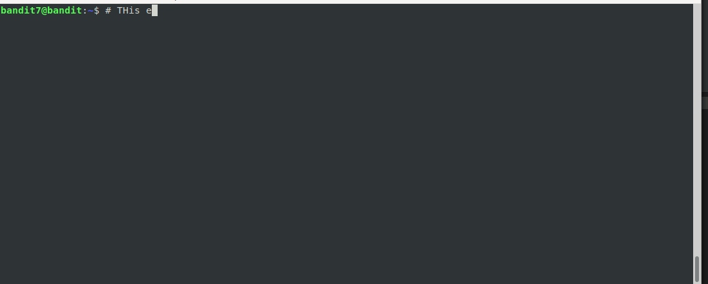

# Level 7

## <a name='Overview'></a>Overview

In this level, you'll learn how to search for text inside a file. Comes in
handy when you want to find a password in a file someday ;)

<!--NOTE: Do not edit table of content's. This is auto generated using an vscode-extension. -->
## <a name='TableofContents'></a>Table of Contents
<!-- vscode-markdown-toc -->
* [Overview](#Overview)
* [Table of Contents](#TableofContents)
* [Completing the Level Goal](#CompletingtheLevelGoal)
	* [Command Demo](#CommandDemo)
* [Learning Byte: Fun Fact about Grep](#LearningByte:FunFactaboutGrep)
* [Learn More](#LearnMore)

<!-- vscode-markdown-toc-config
	numbering=false
	autoSave=true
	/vscode-markdown-toc-config -->
<!-- /vscode-markdown-toc -->

## <a name='CompletingtheLevelGoal'></a>Completing the Level Goal

The main command to use here is `grep` which has the following syntax:

```shell
grep "THE PATTERN" thefile.thisisafile
```

### <a name='CommandDemo'></a>Command Demo



## <a name='LearningByte:FunFactaboutGrep'></a>Learning Byte: Fun Fact about Grep

`GREP` stands for **G**lobal **R**egular **E**xpression **P**rint

Source: https://kb.iu.edu/d/abnd

## <a name='LearnMore'></a>Learn More

* [About Grep](https://kb.iu.edu/d/afiy)
