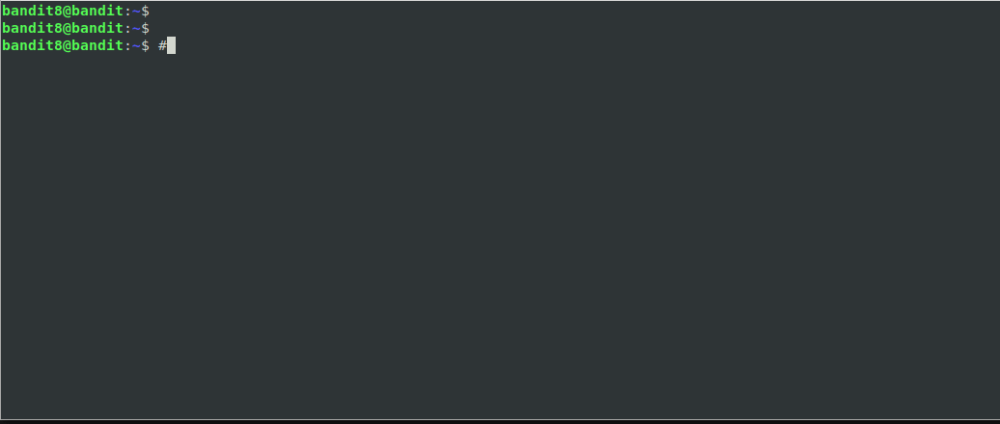

# Level 8

## Overview

Files contain a *lot* of data. This level shows you the basics of finding
info within a file.

<!--NOTE: Do not edit table of content's. This is auto generated using an vscode-extension. -->
## Table of Contents
<!-- vscode-markdown-toc -->
* [Overview](#Overview)
* [Table of Contents](#TableofContents)
* [Completing the Level Goal](#CompletingtheLevelGoal)
	* [Command Demo](#CommandDemo)
	* [Command Breakdown](#CommandBreakdown)
* [Learn More](#LearnMore)

<!-- vscode-markdown-toc-config
	numbering=false
	autoSave=true
	/vscode-markdown-toc-config -->
<!-- /vscode-markdown-toc -->

## Completing the Level Goal

If you look at the file, there are a lot of lines in it. In this level `sort`
and `uniq` are your friends.

### Command Demo

### Command Breakdown

These commands are pretty striaght forward, check out the `man uniq` page to
see what the `-c` and `-u` commands do.

## Learn More

* [Back to Basics: Sort an Uniq](https://www.linuxjournal.com/content/back-basics-sort-and-uniq)
