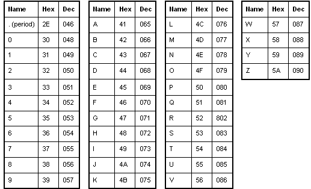

# Level 11

## <a name='Overview'></a>Overview

In [Level
10](https://github.com/j0n3lson/codenext-clubs-linux-admin/tree/master/solutions/10)
you learned about base64 encoding and a bit about Cryptograpy. This level
continues the discussion on cryptography while introducing another handy
tool.

<!--NOTE: Do not edit table of content's. This is auto generated using an vscode-extension. -->
## <a name='TableofContents'></a>Table of Contents
<!-- vscode-markdown-toc -->
* [Overview](#Overview)
* [Table of Contents](#TableofContents)
* [Completing the Level Goal](#CompletingtheLevelGoal)
	* [Command Demo](#CommandDemo)
	* [ (Optional) Command Breakdown](#OptionalCommandBreakdown)
* [Learning Byte: Rotating Text and the Cesaer Cypher](#LearningByte:RotatingTextandtheCesaerCypher)
	* [How does the `tr` utility work?](#Howdoesthetrutilitywork)
	* [The Cesear Cipher (a.k.a the *shift cipher*)](#TheCesearCiphera.k.atheshiftcipher)
* [Discussion Points](#DiscussionPoints)
* [Learn More](#LearnMore)

<!-- vscode-markdown-toc-config
	numbering=false
	autoSave=true
	/vscode-markdown-toc-config -->
<!-- /vscode-markdown-toc -->

## <a name='CompletingtheLevelGoal'></a>Completing the Level Goal

The goal for this level is to learn about the `tr` tool. This tool is used to
translate or delete text.

### <a name='CommandDemo'></a>Command Demo

```shell
bandit11@bandit:~$  tr 'A-Za-z' 'N-ZA-Mn-za-m' < data.txt
The password is <I'M NOT TELLING YOU!!!']
bandit11@bandit:~$ 
```

TODO: Use a screen recorder like [Terminalizer](https://terminalizer.com/) or
[Peek](https://github.com/phw/peek) to record how to beat the level. Add as
many *Command Demos* or *Command Breakdowns* as needed to get the point
across.

### <a name='OptionalCommandBreakdown'></a>Command Breakdown

TODO: Breakdown each portion of a command to illustrate the command, flags, and
important concepts.

## <a name='LearningByte:RotatingTextandtheCesaerCypher'></a>Learning Byte: Rotating Text and the Cesaer Cypher

### <a name='Howdoesthetrutilitywork'></a>How does the `tr` utility work?

Technically, `tr` is just replacing characters using a map. It first parses
the arguments, here SET1=`A-Za-z` and SET2=`N-ZA-Mn-za-m` into separate
ranges. For SET1 there are two ranges `A-Z` and `a-z`. Then it maps them onto
the ranges in SET2. The actual
[code](https://github.com/coreutils/coreutils/blob/master/src/tr.c) is a bit
more complicated than this but this is good enough for us.

Taking a step back, you can see the effect is that every character in the
file has been rotated (or shifted) 13 positions to the right. So if you see
the character *A* in the file, it's shifted value is *N*. For the character
*B*, it's shifted value is M*. That's because *N* is exactly 13 positions away
from *A* in the ASCII table.



### <a name='TheCesearCiphera.k.atheshiftcipher'></a>The Cesear Cipher (a.k.a the *shift cipher*)

Rotating text is a very old technique used by the ancients to had messages.
Back in that time, rulers used to send messages by writing it down on a paper
and having a person run the message over to it's recipient. Message could
travel great distances by having multiple runners pass the note like a relay
race.

Juleaus Cesaer was one such ruler and he needed to send messages to his
generals. He correctly identified that sending message via runner was
insecure: Anyone who had the message could just simply read it or copy it. He
figured it would be bad if his battle plans somehow made it to the enemy's
hands. In other words, he recognized that is messages weren't very
*Confidential*.

In order the fix this, the story goes, he invented the Cesear cipher. In this
simple substituion scheme, each letter in the plaintext is replaced by a
letter some fixed number of positions further down in the alphabet.

## <a name='DiscussionPoints'></a>Discussion Points

* What might happen if you ran a message through a Caesar cipher multiple times?
* Why do you have to give two ranges `N-Z` and `A-M` in the `tr` command for SET2?
What happens if you only give `N-Z` as SET2.

## <a name='LearnMore'></a>Learn More

* Video: [The Caesar Cipher, *Khan Academy*](https://www.khanacademy.org/computing/computer-science/cryptography/crypt/v/caesar-cipher)
* Video: [How to make a Cipher wheel, *Youtube*](https://youtu.be/0Xuv58Uwu9o)