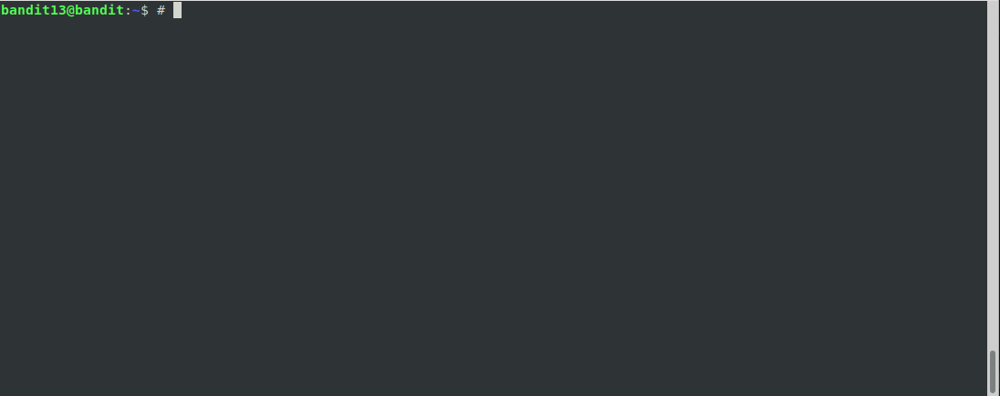
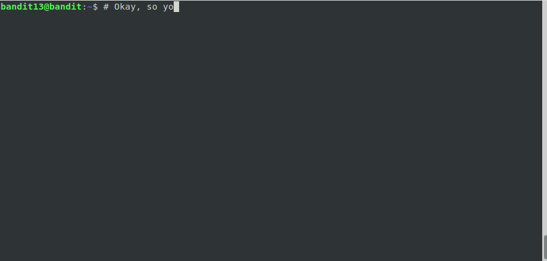

# Level 13

## Overview

In this level, you do the same thing you've been doing this whole time --
connecting via `ssh` to a server. Except this time, there's small twist.

<!--NOTE: Do not edit table of content's. This is auto generated using an vscode-extension. -->
## Table of Contents
<!-- vscode-markdown-toc -->
* [Overview](#Overview)
* [Table of Contents](#TableofContents)
* [Completing the Level Goal](#CompletingtheLevelGoal)
	* [Command Demo](#CommandDemo)
		* [Permission DENIED - You can't haz password](#PermissionDENIED-Youcanthazpassword)
		* [Connecting using `ssh` using a key](#Connectingusingsshusingakey)
	* [Command Breakdown](#CommandBreakdown)
* [Learning Byte - SSH Key Based Authentication and Cryptography](#LearningByte-SSHKeyBasedAuthenticationandCryptography)
	* [The Four Pillars of Cryptography](#TheFourPillarsofCryptography)
	* [Why Cryptography Matters](#WhyCryptographyMatters)
	* [How the `ssh` uses Cryptography for security](#HowthesshusesCryptographyforsecurity)
		* [The SSH Protocol](#TheSSHProtocol)
		* [Public Key encryption](#PublicKeyencryption)
* [Discussion Points](#DiscussionPoints)
* [Learn More](#LearnMore)

<!-- vscode-markdown-toc-config
	numbering=false
	autoSave=true
	/vscode-markdown-toc-config -->
<!-- /vscode-markdown-toc -->

## Completing the Level Goal

This entire time, you've been using the `ssh` utility to connect to the game
server. When you beat a level, you connected to the next level via `ssh` as
well.

This entire time, you've been using a password username and password to login
-- but that's not really necessary. You can use an ssh *key* to login as
well.

### Command Demo

#### Permission DENIED - You can't haz password

The instructions point to a password in a file `/etc/bandit_pass/bandit14`
only, you as `bandit13` do not have permissions. 

NOTE: If you're still a bit hazy about permissions, check out the [Linux File
Permissions](https://github.com/j0n3lson/codenext-clubs-linux-admin/blob/d2c91f6487233aef8ada34cab634009b370ef715/solutions/05/readme.md#linux-file-permissions)
learning byte back on Level 5.

#### Connecting using `ssh` using a key

### Command Breakdown

You're all old enough here to look at the `man` page (e.g. `man ssh`) and
find out what each flag does.

## Learning Byte - SSH Key Based Authentication and Cryptography

### The Four Pillars of Cryptography

As you're read in a previous lesson, Cryptography focuses on four main
pillars: *Confidentiality*, *Integrity*, *Non-Repudiation*, and
*Authentication* ( See [What is Cryptography all
about?](https://github.com/j0n3lson/codenext-clubs-linux-admin/tree/master/solutions/10#what-is-cryptography-all-about)).
It turns out, if you're going to talk to a remote server, you really want to
have all four things covered.

### Why Cryptography Matters

Imagine you need to login to your bank account to transfer all your money to
me because you enjoyed this class so much. You want to be as secure as
possible, but you have a few problems:

* __Confidentiality__: If you send your password, can you be sure no one other
than the bank can read the password?

* __Integrity__: If you type *"Transfer $10 to Coach"*, can you be sure someone
didn't change it to *"Transfer $1,000,000 to Coach"* before it reached the
bank server?

* __Authentication__: When you type www.youfavoritebank.com, how do you even
know that the webpage you reached is actually your bank? When you log in, how
does your bank know that it's *you* loging in and not *Lateesha Q.
HackerQueen*?

\* _Non_Repudiation_ is also a pillar, but it doesn't really apply to this scenario.

### How the `ssh` uses Cryptography for security

#### The SSH Protocol

The `ssh` protocol is an example of how cryptography is used to *secure*
connections to remote server. `ssh` is both the *name* of a utility and
shorthand for talking about the *ssh protocol*. A *protocol* is just an
agreement on how to do something. In the case of `ssh`, the *something* that
needs agreement is how to exchange messages with a computer securely.

In the SSH protocol, both computers:

* Agree to use public key encryption
* Agree to encrypt each message that is sent

The [SSH Sequence diagram](#SSHSequenceDiagram) shows show an SSH connection
is set up.

#### Public Key encryption

Public Key Encryption is a way to encrypt plain text using a key that is
split in half. The *Public Key* is a key that that is freely shared. The
other half, the *Private Key* is ... well *private*. If I want to send a
message to you, here's what I have to do in order to use Public Key
Encryption:

1. First you have to give me your public key.
2. Then, I use your publick key to encrypt (or encypher) the plaintext.
3. I send it to you some how (maybe via email, or the network, or by runner).
4. When you get it, you *decypt* it using your private key.

Because of how the key pairs were generated (and some confusing math about
large primes), Public and Private keys are unique pairs. For every Public
key, there is a single Private key which means a message can ONLY be
decrypted if you have the maching private key.

Because two keys are used, Public Key Encryption is often called
*Asymmetrical Encryption"

## Discussion Points

1. How does SSH provide *Confidentiality*? *Integrity*? *Authentication*?

2. There are other protocols that enable remote login such as `telnet`.
Compare and contrast`telnet` to `ssh`. Based on the 4 pillars, is `telnet`
secure? *[*Hint*](#SSHBeginnersVideo)*

## Learn More

* (Article): [SSH Essentials: Working with SSH Servers, Clients, and Keys; *Digital Ocean*](https://www.digitalocean.com/community/tutorials/ssh-essentials-working-with-ssh-servers-clients-and-keys)

* (Article): [Symmetric vs. Asymmetric Encryption – What are differences?; *SSL2BUY*](https://www.ssl2buy.com/wiki/symmetric-vs-asymmetric-encryption-what-are-differences)

* (Video): [Beginners Guide to SSH; *Youtube*](https://www.youtube.com/watch?v=qWKK_PNHnnA). Up to the 2:15 mark.

* (Diagram): [SSH Connection Setup](sshsequence.png)