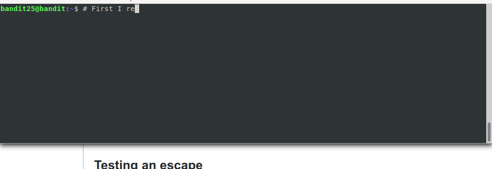
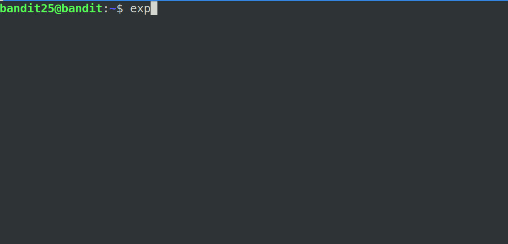
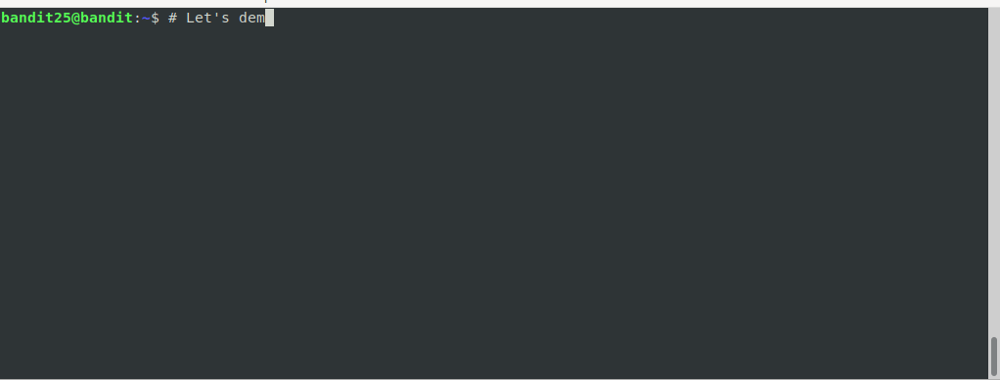

# Level 25

## Overview

This level is very very tricksy. You need to pay close attention to how
things are setup, commands and how they work.

## Table of Contents
- [Level 25](#level-25)
	- [Overview](#overview)
	- [Table of Contents](#table-of-contents)
	- [Completing the Level Goal](#completing-the-level-goal)
		- [Command Demo](#command-demo)
		- [The Breakdown](#the-breakdown)
			- [Things that *DON'T* work](#things-that-dont-work)
			- [What the *shell*!?](#what-the-shell)
			- [*More* on `more`](#more-on-more)
			- [Putting it all together. Escaping the Shell](#putting-it-all-together-escaping-the-shell)
				- [Changing the shell](#changing-the-shell)
	- [Discussion Points](#discussion-points)
	- [Learn More](#learn-more)

## Completing the Level Goal

For this level you have to ask a bunch of questions. The answers will reveal
what to do next. Jump to the Command Breakdown section to walkthrough the
sequence of questions needed to understand the level and ultimately escape!

### Command Demo



### The Breakdown

#### Things that *DON'T* work

| Option to try                                                 | Example                                                                 | Result                                                |
| ------------------------------------------------------------- | ----------------------------------------------------------------------- | ----------------------------------------------------- |
| Simply logging in with the given ssh key                      | `ssh -i bandit26.sshkey bandit26@localhost`                             | You get Logged out right away.                        |
| Running a command                                             | `ssh -i bandit26.sshkey bandit26@localhost /bin/sh`                     | Nothing happens it it feels like it got stuck.        |
| Reading the password file                                     | `cat /etc/bandit_pass/bandit27`                                         | The file is owned by `bandit27` so you can't read it. |
| Disable pty allocation so you don't get an interactive prompt | `ssh -T -i bandit26.sshkey bandit26@localhost`                          | You are immediately logged out.                       |
| Crying inside because nothing makes sense :(                  | There is no command for sadness, or happiness, but you can be `nice` :) | You need a lot of napkins.                            |

####  What the *shell*!? 

The level instructions point out that the shell is *not* `/bin/bash`. The
`/bin/bash` program is a shell, a special program that helps you run other
programs. On my *nix computers it's the default. It's what you get dropped
into right after you login.

But if it's not `/bin/bash` what is it?

You can find this answer in the `/etc/passwd` config file which is set when
the `useradd` command is used to add a new system user (see `man useradd`).
Greping through this file we see:

```shell 
bandit25@bandit:~$ grep "bandit26" /etc/passwd
bandit26:x:11026:11026:bandit level 26:/home/bandit26:/usr/bin/showtext
bandit25@bandit:~$ 
```

So every time bandit26 logs in, `/usr/bin/showtext` is used as the shell. The next section explores what this "shell" really is.

#### *More* on `more`

Looking at `/usr/bin/showtext` reveals a few intereting facts:

```shell
# It's actually a script

bandit25@bandit:~$ file /usr/bin/showtext
/usr/bin/showtext: POSIX shell script, ASCII text executable
bandit25@bandit:~$ 

# Who's contents are strange. Let's look line by line
bandit25@bandit:~$ cat /usr/bin/showtext
#!/bin/sh                   # This just says use the /bin/sh program 
                            # to run this script.

export TERM=linux           # Not relly relevant to this level.

more ~/text.txt	  			# This runs the 'more' command on the text file.
exit 0					    # When the 'more' command exits, also exit the shell
bandit25@bandit:~$ 
```

The result of the `/usr/bin/showtext` script is that you get stuck running
`more` and if you exit, you also exit the shell. This is why you are
immediately logged out. Turns out that you can actually run commands when in the interactive mode of `more`...which seems promising.



So you can run arbitrary commands when in interactive mode. Maybe if you can run `cat /etc/bandit_pass/bandit26` you'd be good to go right? But how do we make `more` go into interactive mode?

*Answer*: Resize the window, then the contents are bigger than the window size so you have to enter interactive mode.

#### Putting it all together. Escaping the Shell

So it turns out that you can run commands but it still doesn't work? The secret lies in the fact that every command you run also spawns another shell.

And what is the shell assigned to `bandit26`? The `/usr/bin/showtext` shell which is trapping us :s in the first place.

##### Changing the shell

But what if you could *change* the shell somehow?

If you read the `man more` page carefully, it says that you can hit `v` from interactive mode to enter `vi`. The `vi` utility is a text editor like `nano`, `vim`, or `ed`. Like `more`, you can run shell commands from `vi`. But just like `more` the shell that `vi` uses is the system defined shell for the user, e.g `/usr/bin/showtext`. Fortunately you can change that.



Once you're in a shell, you can run any command as normal.

## Discussion Points

None

## Learn More

None