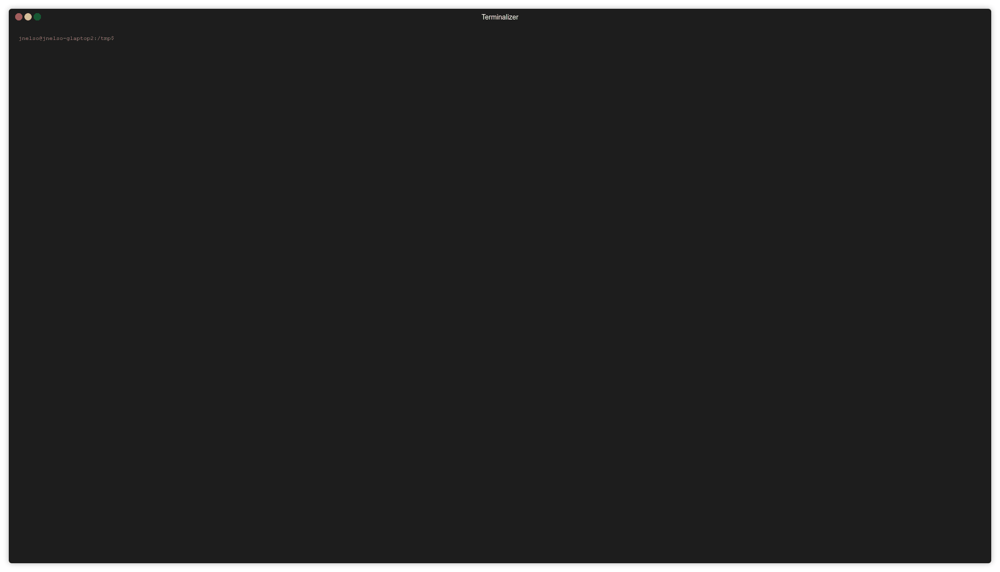
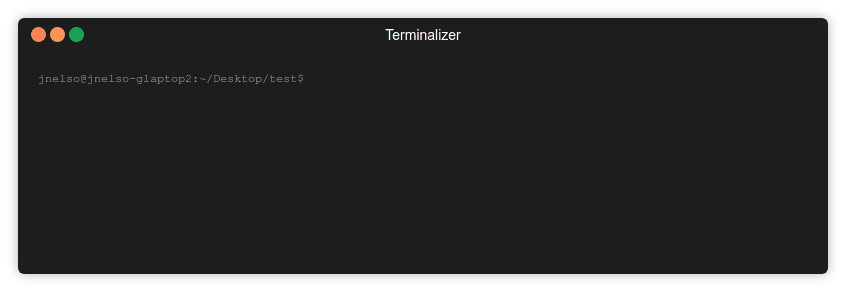

# Level 0 --> 1 Solution

This level is pretty is pretty basic so I'll only provide a demo. There are suggested commands you can use and I encourage you to read the `man` page for each of them to get an overview of what they do.

### Command Demo: How to find what commands dow with `man`

### Command Demo: Listing the files in a directory with `ls`

### Command Demo: Reading a file with `cat`

### Command Demo: What directory am In again? Find out with `pwd`

